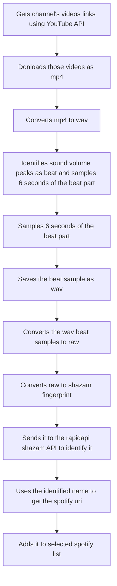

# Boring-Beat-Flow

## Description
"Boring Beat Flow" is a simple yet fun project that turns the seemingly mundane task of cataloging beats from YouTube videos into an automated and entertaining experience. With this tool, you can effortlessly compile the names of all beats featured across a YouTube channel's videos and seamlessly add them to your private Spotify playlist. 

## Disclaimer
Please note that "Boring Beat Flow" is a project created purely for fun and personal use. The creator of this project is not a professional developer and does not possess the expertise of a professional software designer.

This project is not intended to be a user-friendly, all-encompassing solution that caters to a wide range of needs. It was conceived as a hobbyist's endeavor, born out of the desire to automate a specific task for personal enjoyment. As such, the features and functionality may be limited and may not be optimized for broader use.

"Boring Beat Flow" serves a very specific purpose: to automate the process of discovering and adding beats from a particular YouTube channel (https://www.youtube.com/@BlakeBachert) to a private Spotify playlist. It was designed with the creator's individual preferences and requirements in mind.

Users who choose to interact with "Boring Beat Flow" should be aware that it is an experimental and non-professional project, and it is not guaranteed to meet their expectations or needs beyond its original scope. It is advisable to approach the project with an understanding of its limitations and the context in which it was developed.

The creator of "Boring Beat Flow" appreciates your interest in the project and hopes that you find value in its creative and exploratory spirit.

## How this project works


## How to use

### Install requirements:
```shell
pip install -r requirements
```

### Usage:
```powershell
usage: main.py [-h] [-c CHANNEL] [-y YOUTUBE_API_KEY] [-l LOAD_PATH] [-d SAVE_DIR] [-sh SHAZAM_API_KEY]
               [-sp SPOTIFY_ACCESS_TOKEN] [-p SPOTIFY_PLAYLIST]

Just a simple program to automate stuff :3

options:
  -h, --help            show this help message and exit
  -c CHANNEL, --channel CHANNEL
                        Target YouTube Channel URL
  -y YOUTUBE_API_KEY, --youtube-api-key YOUTUBE_API_KEY
                        Youtube Api Key
  -l LOAD_PATH, --load-path LOAD_PATH
                        Load already downloaded wavs
  -d SAVE_DIR, --save-dir SAVE_DIR
                        Location to write files
  -sh SHAZAM_API_KEY, --shazam-api-key SHAZAM_API_KEY
                        Shazam API Key
  -sp SPOTIFY_ACCESS_TOKEN, --spotify-access-token SPOTIFY_ACCESS_TOKEN
                        Spotify Access Token
  -p SPOTIFY_PLAYLIST, --spotify-playlist SPOTIFY_PLAYLIST
                        Spotify Playlist Name
```

## Community Engagement and Contributions:

Your interest in "Boring Beat Flow" is greatly appreciated! While this project began as a personal endeavor for fun, your involvement can make it even more dynamic. Feel free to contribute by reporting any bugs you encounter, sharing your suggestions for changes, proposing new features, and suggesting improvements. Your input could potentially shape the evolution of this project.

However, it's important to note that due to the project's experimental and non-professional nature, there are no promises that suggested changes, features, or improvements will be implemented. "Boring Beat Flow" is a creative playground, and any enhancements will depend on the creator's capacity and the project's scope. So, let your ideas flow and help us explore the potential of this quirky project together!

